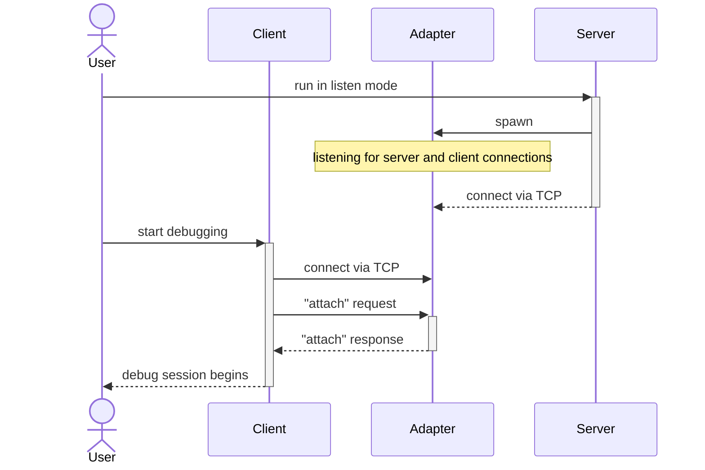
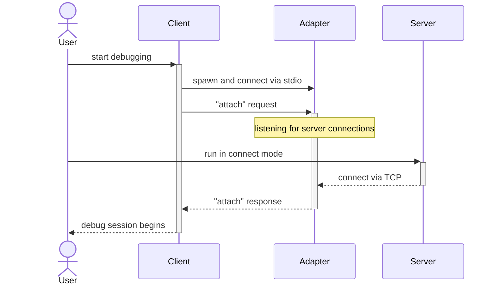
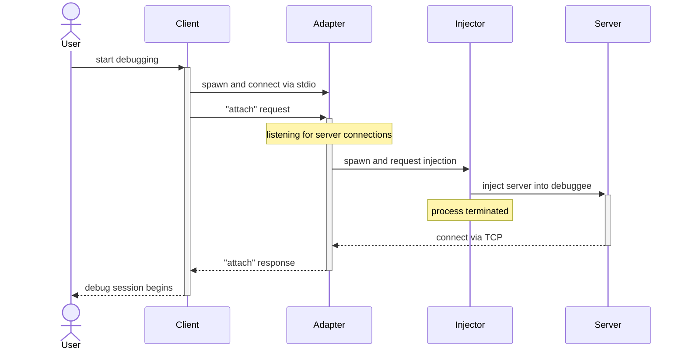
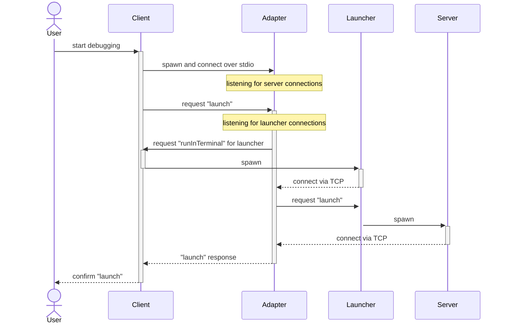

# Debug Adapter Protocol

debugpy is an implementation of [DAP](https://microsoft.github.io/debug-adapter-protocol/specification) for Python.

DAP has two layers. The lower-level messaging layer is a generic protocol that deals with requests, responses to them, and response-free events in a transport-agnostic manner, requiring only a stream of bytes. The upper level is the specific requests, responses, and events that pertain to debugging, such as "setBreakpoints".

In debugpy, the messaging layer used not only to communicate to the client such as Visual Studio or Visual Studio Code, but also internally to communicate between various debugpy components across process boundaries, using custom messages that are specific to debugpy. Depending on the components involved and the exact scenario, either standard input/output or TCP sockets are used as a transport. 

# debugpy components

## pydevd

pydevd is an *in-process* Python debug server that supports DAP among other protocols. By itself, it provides all the core debugging functionality: source and exception breakpoints, stepping, stack traces etc. However, it requires that the user either loads pydevd into the debuggee process, or uses command line to spawn the debuggee via pydevd, which then ensures that the server gets loaded first. Thus, it cannot meaningfully handle DAP requests which assume that debuggee is not in the picture yet (i.e everything up to and including "launch" and "attach" requests). Also, since it is itself written in Python, it is constrained by GIL and other in-process locks in its ability to timely handle DAP requests in general.

When pydevd is used as a debug server by itself, the expectation is that the DAP client connects directly to it.

## debugpy.server

The debugpy debug server is thin wrapper around pydevd that activates it after configuring it to use DAP (and other customizations that produce the desired end-user behavior in VS and VSCode). Similar to pydevd, it provides an API to load itself into the debuggee process, and a CLI to spawn the debuggee with debugpy already loaded - this allows for debugpy to provide its own API stability and support guarantees, distinct from pydevd.

Unlike pydevd, debugpy.server does not expect to communicate directly to the client, but rather to debugpy.adapter. In multiple-process scenarios, each process has its own debugpy.server (and thus also its own pydevd), but they all talk to the same adapter.

debugpy.server also provides a facility to inject a copy of itself into a running process. In this mode, it doesn't actually act as a server, but rather as a command line utility that performs the injection and immediately exits; the *injected* server then acts as a debug server.

## debugpy.adapter

The debugpy adapter is where most functionality that is specific to debugpy is implemented. It is a separate process that sits between the DAP client and the debug server. Its primary job is to manage the lifetime of the debug session, handling the initialization up to and including "launch" and "attach" requests, and then capturing and redirecting process output while debuggee is running, reporting process exit and/or force-killing the process if requested at the end of the session. 

For multiple-process scenarios, the adapter keeps track of individual processes that constitute the logical debug session and reports any newly spawned subprocesses to the client for the latter to attach to.

## debugpy.launcher

This is a helper process that debugpy.adapter uses to launch individual debuggee processes. Each debuggee process has its own separate launcher process that performs the actual spawning of the former, captures its stdin/stdout/stderr, and serves as a watchdog to detect process exit. It is spawned by the adapter, and only communicates with it directly; the adapter is responsible for forwarding output capture and exit reporting to the client.

The main reason why launcher is a separate process from the adapter is because spawning the debuggee directly via "runInTerminal" DAP request does not allow for output capture. With a separate launcher, the adapter first spawns the launcher via "runInTerminal"; the launcher then spawns the debuggee directly via the appropriate OS APIs. This also allows for the launcher to set up a distinct job object or process group to better control the lifetime of the debuggee.

# Basic scenarios

There are several scenarios involving debugpy that differ in UX flow. The following sections describe those scenarios, first from the end user perspective, and then in terms of how components interact. For the sake of simplicity, these descriptions all assume a single process being debugged, without any subprocesses; the latter are discussed separately. 

## Attach client to server via TCP

### User perspective

In this scenario, the user has to start the debug server manually via debugpy API or CLI, and then direct the client to connect to it. For example, the following command line:
```sh
python -m debugpy --listen 127.0.0.1:5678 foo.py
```
or the following API call:
```py
import debugpy
debugpy.listen(("127.0.0.1", 5678))
```
has the corresponding debug configuration:
```json5
{
    "connect": {
        "host": "127.0.0.1",
        "port": 5678,
    }
}
```
In this scenario, user code in the debuggee starts executing before the client connects, unless it is explicitly directed to wait via `--wait-for-client` or `debugpy.wait_for_client()`.

### Implementation



## Attach server to client using TCP

### User perspective

This scenario is similar to the one above, except that the user instructs the client to listen for incoming connections and then directs the debug server to connect to it. For example, the following debug configuration in VSCode:
```json5
{
    "listen": {
        "host": "127.0.0.1",
        "port": 5678,
    }
}
```
corresponds to the following command line:
```sh
python -m debugpy --connect 127.0.0.1:5678 foo.py
```
or the following API call:
```py
import debugpy
debugpy.connect(("127.0.0.1", 5678))
```

Since `connect()` only returns once connection is established, this mode inherently waits for the client before running user code.

### Implementation



## Attach to local process by PID

### User perspective

This scenario is similar to attaching server to client, but instead of the user starting the server manually, the code that does so is injected into a running Python process that is not debugpy-aware. The debug configuration only has to specify the process ID:
```json5
{
    "processId": 42 
}
```
In practice, a picker is normally used instead of hardcoding the PID - e.g. `"${command:pickProcess}"` in VSCode. This is handled entirely by the client, so in any case the configuration has the actual PID subtituted into it by the time debugging starts.

### Implementation

The code that performs the injection is located in the debug server, but it is separate from the actual server logic, and is only meant to be invoked via CLI like so:
```sh
python -m debugpy --connect 127.0.0.1:5678 --pid 42
```
This causes the server to inject *another* copy of itself into the target process, as if it were spawned with `-m debugpy --connect 127.0.0.1:5678`, and then exit. The copy that was loaded in the debuggee process will actually connect to the specified port, and from there it proceeds identical to standard TCP attach. Both `--listen` and `--connect` are supported.

The user can, in fact, do this manually, and then direct the client to do the standard TCP attach. Normally, however, they use the debug configuration as described above, in which case the adapter takes care of the injection:


The actual injection is performed in a platform-specific way by pydevd. On Windows, it uses `CreateRemoteThread` to load a DLL into the target process and run a native function in it. On Linux and macOS, it uses gdb to the same effect. In both cases, once native code has been injected, it locates the Python DLL used by the process and invokes `PyRun_SimpleString` to import debugpy and start the server.

## Launch

### User perspective

Launch is the simplest scenario to the user because UX is confined to the DAP client - they just need to invoke the "Start Debugging" command or equivalent. Debug configuration looks something like:
```json5
{
    "type": "python",
    "request": "launch",
    "program": "main.py", // or "module", or "code"
    "console": "integratedTerminal",
}
```

### Implementation

The following flowchart is for the most common case when "console" in debug config is set to "integratedTerminal" or "externalTerminal". When it is "internalConsole", the adapter spawns the launcher directly instead of using "runInTerminal".



At this point, user code is running in the server process and getting traced by pydevd, which sends all the relevant DAP events to the adapter, which forwards them to the corresponding client session. If client issues requests to the adapter, they're forwarded to the corresponding server session, and responses are propagated back.

In the meantime, the launcher monitors stdin/out/err pipes for the debuggee, and sends any output captured from them to the adapter as "output" events. The launcher also monitors the state of the server/debuggee process and sends an "exited" event to the adapter when the process exits. These are all also forwarded to the client.

If the user requests the debug session to end, the client sends a "disconnect" or a "terminate" request to the adapter, depending on the specific command. If the request is to kill the process and not merely disconnect from it, the adapter propagates it to the launcher for handling.

